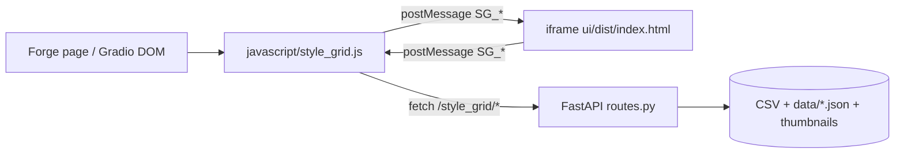
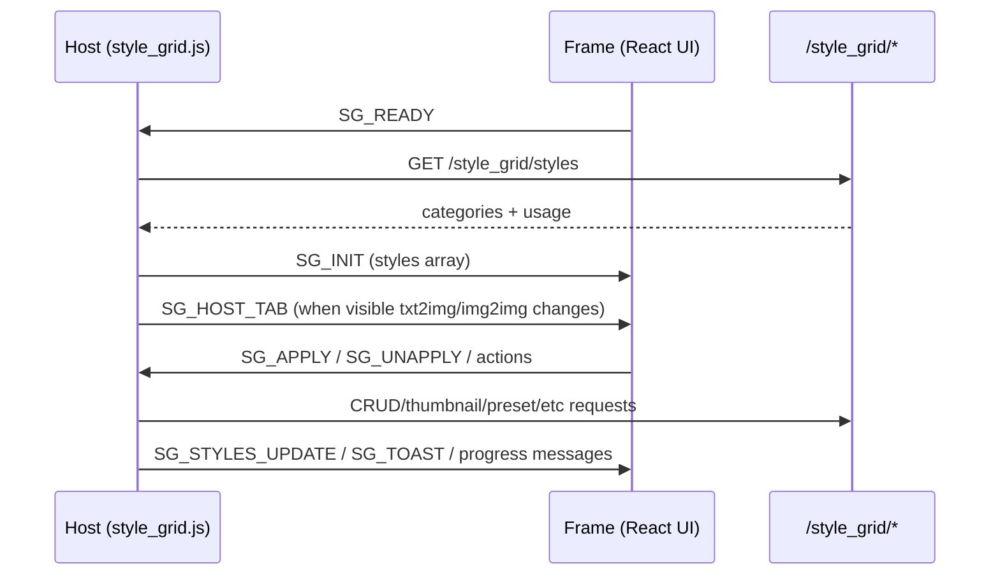

# Development Guide

## Current Architecture (V2)

The extension now uses a hybrid architecture:

- Host layer: `javascript/style_grid.js` (Forge page integration, iframe lifecycle, prompt-side effects).
- Backend API: `stylegrid/routes.py` and modules under `stylegrid/` (cache, CSV I/O, thumbnails, wildcards).
- UI app: `ui/` (React + TypeScript + Vite + shadcn-style components), served inside iframe.



## Repository Layout

```text
.
├─ javascript/style_grid.js           # Host integration + iframe bridge
├─ scripts/style_grid.py              # Forge script entrypoint (imports stylegrid.*)
├─ stylegrid/                         # Backend package (routes, cache, csv_io, thumbnails, wildcards)
├─ ui/                                # React app (builds to ui/dist)
│  ├─ src/bridge.ts                   # Typed SG_* message contract
│  ├─ src/store/stylesStore.ts        # Client state/actions/derived filters
│  └─ src/components/                 # UI building blocks
├─ tests/                              # pytest (csv_io, routes, wildcards); test_js.html
├─ docs/API.md
├─ docs/CSV_FORMAT.md
└─ docs/DEVELOPMENT.md
```

## Local Development

### Backend/host script

- Loaded by Forge from extension root; no separate backend server process.
- Main API registration path: `stylegrid/routes.py` → `register_api(...)` (imported from `scripts/style_grid.py`).

### UI app

```bash
cd ui
npm install
npm run build
```

The host iframe points at `ui/dist/index.html`, so run `npm run build` after UI changes.

## Message Bridge (Host <-> Frame)

Bridge types are declared in `ui/src/bridge.ts`.



**Source filter ↔ host:** `SG_SOURCE_CHANGE` carries the selected CSV path (or `null` for All Sources). The host updates `state[tab].selectedSource` / `selectedSourceFile` and the visible source button label. The store avoids echoing duplicate posts when the path is unchanged. **`SG_GENERATE_CATEGORY_PREVIEWS`** may include optional `source`; the host fetches `/style_grid/styles` and filters by category and that source so batch thumbnail jobs match the iframe’s active CSV (not a stale name-only cache).

**Iframe routing:** Forge mounts **two** Style Grid iframes (txt2img / img2img). Each tab’s `window.addEventListener("message", …)` must ignore events where `event.source !== frame.contentWindow`, otherwise both handlers would run for every postMessage (wrong tab, wrong `selectedSource`, etc.).

**Thumbnails:** Cached files live under `data/thumbnails/` with names derived from `stylegrid.thumbnails.get_thumbnail_path(name, source_file)`. `GET /style_grid/thumbnail` resolves files using the style `name` and the cached styles list (see `docs/API.md` § GET `/thumbnail`); the iframe may still add `source` / `v` on the image URL for cache behavior. Per-style **Generate preview** uses `POST /style_grid/thumbnail/generate` with optional `source` in the JSON body (host passes `selectedSource`) so the worker picks the right row when names collide.

**Silent mode:** injection for `scripts/style_grid.py` `process()` reads the hidden Gradio component `style_grid_silent_<tab>` (JSON array of style names). The host keeps that in sync via `setSilentGradio()` from `state[tab].selected` while `silentMode` is on. `SG_UNAPPLY` must remove the id from both `applied` and `selected`; `SG_TOGGLE_SILENT` with `value: false` runs `clearHostSilentSelection` and `postClearSelectionToIframes` (`SG_CLEAR_SELECTION`). **Source of truth for generation is the host textbox**, not the iframe selection UI: after silent turns off, V2 may still show tiles/chips as selected until the user toggles or clears — that mismatch is visual-only and must not imply silent styles are still injected.

**Forge script outputs:** `StyleGridScript.ui()` still creates `style_grid_data_*`, `style_grid_selected_*`, the silent textbox, and the apply trigger, but **`return` is only `[silent_styles]`** so `process(*args)` receives a single argument (silent JSON). Wildcard resolution uses `p.all_prompts` / `p.all_negative_prompts` from the pipeline, not those hidden textboxes.

**CSV table editor (currently disabled):** The 📋 control appears in both the **React header** (`ui/src/App.tsx`, disabled `ToolBtn`) and the **classic host panel** toolbar (`javascript/style_grid.js`, disabled button after Refresh). Tooltips state that the editor is **temporarily unavailable**. The live `openCsvTableEditor` in the host script is a **no-op stub**; the previous full implementation is kept in a **block comment** directly above that stub (search for `CSV table editor — full implementation`). Styles for the overlay live in **`style.css`** under `.sg-csv-*` and `.sg-csv-editor-btn-disabled`.

- **`SG_CSV_EDITOR`:** The iframe message type remains in `ui/src/bridge.ts` for typing, but the React button does not send it while disabled. If something posts `SG_CSV_EDITOR`, the host answers with **`SG_TOAST`** (`info`) instead of opening the editor; the original handler body is **commented** next to the active branch in `initSGFrame`’s `message` listener.
- **Re-enabling (outline):** (1) Uncomment the large block and remove the stub `openCsvTableEditor`. (2) Uncomment the old `SG_CSV_EDITOR` handler and remove or replace the toast-only branch. (3) Re-enable the host 📋 button (remove `disabled`, wire `openCsvTableEditor` again) and the React `ToolBtn` (`disabled` off, `onClick: () => sendToHost({ type: 'SG_CSV_EDITOR' })`).  
- **Behavior when active (for reference):** The real editor resolved the target file from **`getStoredSource(tab)`** (localStorage-backed), not a stale dropdown snapshot. **All Sources** was rejected up front. The iframe-triggered path used the **visible** Forge tab (`style_grid_wrapper_*` visibility) to pick `txt2img` vs `img2img`.

**DOM:** `qs(sel, root?)` queries from `root` when provided, otherwise falls back to `gradioApp()` when available.

## Data and Persistence

- `data/presets.json`: presets storage.
- `data/usage.json`: usage counters.
- `data/category_order.json`: backend-persisted category order.
- `data/thumbnails/`: thumbnail files.
- `data/backups/`: CSV backups.

Client-side localStorage keys are also used for UI state (`favorites`, `recent`, source filter, collapsed categories, etc.).

## Testing

| Layer | How |
|-------|-----|
| **Python** | `python -m pytest tests/ -q` — CSV I/O, HTTP routes, `{sg:…}` wildcards (`tests/README.md`). |
| **JS prompt helpers** | Open `tests/test_js.html` in a browser (no server). |
| **UI** | Included in root `npm run lint` via `lint:ui` (`npm --prefix ui run lint`). No Jest/Vitest suite yet. |

Gaps worth knowing: React/iframe logic and `javascript/style_grid.js` are not covered by CI automation; regressions are caught by manual QA or future e2e tests.

## Practical Notes

- Keep `stylesStore.filteredStyles()` and host-side style payload behavior aligned. If host dedups too early, source-aware UI features (like source picker on dedup cards) cannot work correctly.
- Category ordering logic should remain source-aware: All Sources behavior and specific-source behavior are intentionally different.
- When changing bridge messages, update both `ui/src/bridge.ts` and host `window.addEventListener("message", ...)` handlers (both iframe instances).
