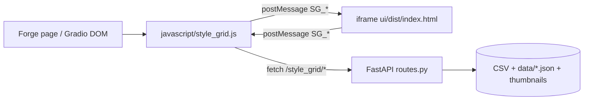
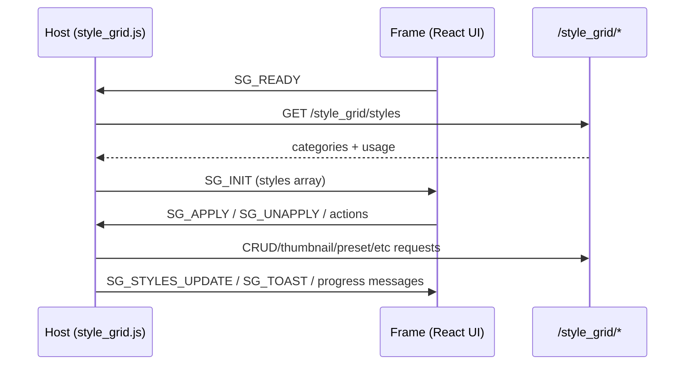

# Development Guide

## Current Architecture (V2)

The extension now uses a hybrid architecture:

- Host layer: `javascript/style_grid.js` (Forge page integration, iframe lifecycle, prompt-side effects).
- Backend API: `scripts/stylegrid/routes.py` (+ helpers under `scripts/stylegrid/*`).
- UI app: `ui/` (React + TypeScript + Vite + shadcn-style components), served inside iframe.



## Repository Layout

```text
.
├─ javascript/style_grid.js           # Host integration + iframe bridge
├─ scripts/style_grid.py              # Forge script entrypoint
├─ scripts/stylegrid/                 # Backend modules (routes/cache/csv_io/etc.)
├─ ui/                                # React app (builds to ui/dist)
│  ├─ src/bridge.ts                   # Typed SG_* message contract
│  ├─ src/store/stylesStore.ts        # Client state/actions/derived filters
│  └─ src/components/                 # UI building blocks
├─ tests/                              # pytest (csv_io, routes, wildcards); test_js.html
├─ docs/API.md
├─ docs/CSV_FORMAT.md
└─ docs/DEVELOPMENT.md
```

## Local Development

### Backend/host script

- Loaded by Forge from extension root; no separate backend server process.
- Main API registration path: `scripts/stylegrid/routes.py` via `register_api(...)`.

### UI app

```bash
cd ui
npm install
npm run build
```

The host iframe points at `ui/dist/index.html`, so run `npm run build` after UI changes.

## Message Bridge (Host <-> Frame)

Bridge types are declared in `ui/src/bridge.ts`.



**Silent mode:** injection for `scripts/style_grid.py` `process()` reads the hidden Gradio component `style_grid_silent_<tab>` (JSON array of style names). The host keeps that in sync via `setSilentGradio()` from `state[tab].selected` while `silentMode` is on. `SG_UNAPPLY` must remove the id from both `applied` and `selected`; `SG_TOGGLE_SILENT` with `value: false` runs `clearHostSilentSelection` and `postClearSelectionToIframes` (`SG_CLEAR_SELECTION`). **Source of truth for generation is the host textbox**, not the iframe selection UI: after silent turns off, V2 may still show tiles/chips as selected until the user toggles or clears — that mismatch is visual-only and must not imply silent styles are still injected.

## Data and Persistence

- `data/presets.json`: presets storage.
- `data/usage.json`: usage counters.
- `data/category_order.json`: backend-persisted category order.
- `data/thumbnails/`: thumbnail files.
- `data/backups/`: CSV backups.

Client-side localStorage keys are also used for UI state (`favorites`, `recent`, source filter, collapsed categories, etc.).

## Testing

| Layer | How |
|-------|-----|
| **Python** | `python -m pytest tests/ -q` — CSV I/O, HTTP routes, `{sg:…}` wildcards (`tests/README.md`). |
| **JS prompt helpers** | Open `tests/test_js.html` in a browser (no server). |
| **UI** | Included in root `npm run lint` via `lint:ui` (`npm --prefix ui run lint`). No Jest/Vitest suite yet. |

Gaps worth knowing: React/iframe logic and `javascript/style_grid.js` are not covered by CI automation; regressions are caught by manual QA or future e2e tests.

## Practical Notes

- Keep `stylesStore.filteredStyles()` and host-side style payload behavior aligned. If host dedups too early, source-aware UI features (like source picker on dedup cards) cannot work correctly.
- Category ordering logic should remain source-aware: All Sources behavior and specific-source behavior are intentionally different.
- When changing bridge messages, update both `ui/src/bridge.ts` and host `window.addEventListener("message", ...)` handlers.
