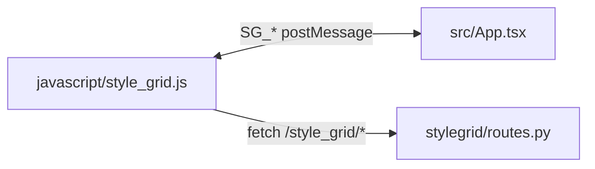

# Style Grid UI (V2)

React + TypeScript + Vite frontend loaded by Forge inside an iframe.

## Commands

```bash
cd ui
npm install
npm run build
```

`npm run build` outputs `ui/dist/`, which is what the host script serves to iframe:

- host path: `javascript/style_grid.js`
- iframe src: `/file=extensions/sd-webui-style-organizer/ui/dist/index.html`

## Key Files

- `src/App.tsx`: top-level layout and toolbar actions.
- `src/store/stylesStore.ts`: state, filters, category order, style toggling.
- `src/bridge.ts`: typed SG_* postMessage contract with host.
- `src/components/*`: UI components (cards, grid, sidebar, modals, etc.).

## Integration Flow


